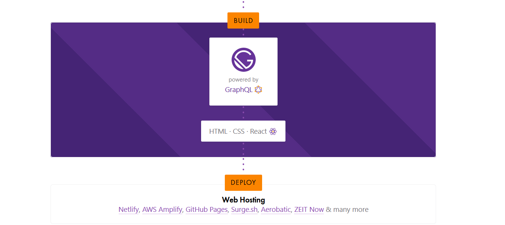

จำได้ว่าเคยเขียน blog ครั้งแรกเมื่อประมาณปี ค.ศ.2003. สมัยนั้น Google เพิ่งเริ่มให้บริการ gmail กับ blogger แบบไม่เป็นทางการ. หลังจากนั้นก็มีพวก wordpress, CMS อื่นๆขึ้นมา. ระยะหลัง medium มีคนใช้เยอะมากขึ้น แต่บางทีอ่านมากไป ระบบก็พยายามบังคับให้จ่ายค่าบริการสมาชิก (เข้าใจว่าเขียนมากไม่เป็นไร). 
เลยคิดว่าถ้าสร้าง blog ขึ้นมาเองน่าจะดีกว่า. จะไปลงทุนทำเซิร์ฟเวอร์เองก็คิว่าไม่คุ้ม เลยคิดว่าถ้าโฮสบน github.com ได้ก็น่าจะดี. เท่าที่หาข้อมูลมาได้รู้ว่าสามารถทำเว็บไซด์เป็น blog ได้ที่ github ในชื่อเราเองเช่น poonlap.github.io โดยทำ repository ชื่อ 
poonlap/poonlap.github.io ซึ่งหลักๆจะใช้ [Jekyll](https://medium.com/20percentwork/creating-your-blog-for-free-using-jekyll-github-pages-dba37272730a) กัน. 

ไหนๆก็ไหนๆ เลยอยากจะ reskill ความรู้ใหม่ ขออะไรที่เป็น nodejs จะดีกว่า. เลยไปที่ react และมาจบที่ [Gatsby](https://www.gatsbyjs.org/).
Gatsby เป็น framework ที่ใช้ React เป็นฐาน ใช้สำหรับสร้างเว็บไซด์และ apps. เราก็จะใช้ Gatsby สร้าง web ซึ่งสุดท้ายจะเป็น static HTML แล้วใช้โฮสให้เราได้.

### สภาพแวดล้อม
- Windows 10
- [Windows Subsystem for Linux (WSL)](https://docs.microsoft.com/en-us/windows/wsl/install-win10) 
- [VS code](https://code.visualstudio.com/) (บนวินโดวส์)
- [Terminal preview](https://devblogs.microsoft.com/commandline/windows-terminal-preview-v0-7-release/)

สมมติในเครื่องมี Ubuntu 18.04 และเครื่องมือต่างๆแล้ว

#### ติดตั้ง node js และ yarn
ใช้ nodejs version 12.x

```:title=bash
# Using Ubuntu
$ curl -sL https://deb.nodesource.com/setup_12.x | sudo -E bash -
$ sudo apt-get install -y nodejs
$ curl -sS https://dl.yarnpkg.com/debian/pubkey.gpg | sudo apt-key add -
$ echo "deb https://dl.yarnpkg.com/debian/ stable main" | sudo tee /etc/apt/sources.list.d/yarn.list
$ sudo apt update && sudo apt install yarn
```
เช็คเวอร์ชั่น node และ yarn
```:title=bash
$ node --version
v12.13.1
$ yarn --version
1.21.1
```
 
<br/><br/>

#### ติดตั้ง Gatsby
ขั้นตอนต่อไปคือติดตั้ง Gatsby และใช้ [Gatsby starter](https://www.gatsbyjs.org/starters/?v=2) เป็นเทมเพลทสำหรับสร้าง blog. Starter ที่ใช้อยู่อันนี้คือ [Gatsby-theme-minimal-blog](https://www.gatsbyjs.org/packages/@lekoarts/gatsby-theme-minimal-blog/)

```:title=bash
$ yarn global add gatsby-cli
$ gatsby new minimal-blog LekoArts/gatsby-starter-minimal-blog
$ cd minimal-blog
$ gatsby develop
```
Gatsby จะสร้างเว็บเซิร์ฟเวอร์สำหรับพัฒนาให้ไว้ที่ port 8000 ถ้าเปิดหน้าเว็บเข้าไปดูจะเห็นเป็นแบบนี้


#### สร้าง post ใหม่
เปิด vs code จาก Ubuntu
```:title=bash
$ code .
```


เวลาสร้างโพสใหม่ ให้สร้างโฟลเดอร์ใหม่และไฟล์ index.mdx ในโฟลเดอร์ใหม่นั้น. เมื่อเซฟแล้ว ตัว gatsby develop มันจะ reload ให้เอง. ถ้าไม่มีปัญหาอะไรจะ refresh โดยอัตโนมัติ.


### Deploy ขึ้น Github
จุดประสงค์สุดท้ายคือเอา blog ขึ้น github.io ขั้นแรกสร้าง repositoy [username].github.io ก่อน แล้วทำให้เป็น puclic. แล้วเราจะใช้ [Travis](https://travis-ci.org/) ช่วย build เป็นเว็บให้อัตโนมัติ. 

```:title=bash
$ cd minimal-blog
$ git init
$ git add .
$ git commit -m “Initial Commit”
$ git branch -m develop
```
สำหรับเว็บที่จะแสดงบน github.io มันจะเอามากจาก branch master. ส่วนใน local เราจะใช้ branch develop เขียนบล็อก. พอ push ไปที่ github แล้ว Travis ก็จะ build branch master ให้อัตโนมัติ.

#### เซ็ต Travis
โดยปกติถ้าจะเอาบล็อกขึ้นไปที่เซิร์ฟเวอร์ ก็จะใช `yarn deploy` สร้างโฟลเดอร์ public แล้วเอาขึ้น github. ซึ่งตรงนี้ใช้ Travis ด้วยได้. เริ่มต้นด้วยการสร้างไฟล์ `.travis.yml`

```yml
language: node_js
cache:
  directories:
    - ~/.npm
notifications:
  email:
    recipients:
      - chen@huchen.me
    on_success: always
    on_failure: always
node_js:
  - '12.13.1'
git:
  depth: 3
script:
  - yarn build
deploy:
  provider: pages
  skip-cleanup: true
  keep-history: true
  github-token: $GITHUB_TOKEN
  local-dir: public
  target-branch: master
  on:
    branch: develop
```

<br/><bt/>

 #### สร้าง token เพื่อให้ Travis ต่อ Github 
 ไปสร้าง [personal access token](https://help.github.com/en/github/authenticating-to-github/creating-a-personal-access-token-for-the-command-line) ใน Github. ที่เมนู Settings > Developers Settings > Personal access tokens.

 

 กดปุ่มสร้าง token แล้วจะได้ค่า token ใหม่มา. ก็อปปี้ไว้แล้วเอาไปใส่ใน Travis. ที่ Travis เข้าไปที่ Settings หา repo ของตัวเองให้เจอ (github.io) แล้วเอา access token ไปใส่.


#### เอา .travis.yml ใส่ใน repo

```:title=bash
$ git add .travis.yml
$ git commit -m “Add Travis config file”
$ git push origin develop
```

ถ้าเราเพิ่มโพสใน Gatsby เรียบร้อยแล้ว commit, push ใน branch develop เมื่อไร, Travis จะ build ไปที่ master ให้อัตโนมัติ.

 


รอให้ Travis build ผ่านแล้วเข้าไปดูที่ [github.io](https://poonlap.github.io) ได้.


### Reference
- [Gatsby-themem-minimal-blog](https://www.gatsbyjs.org/packages/@lekoarts/gatsby-theme-minimal-blog/)<br/>
มีอธิบายเกี่ยวกับการปรับแต่งเทมเพลท เช่น ชื่อไซต์, เมนู ฯลฯ
- [Gatsby.js tutorials](https://www.gatsbyjs.org/tutorial/)<br/>
เรียนรู้การใช้ Gatsby เบื้องต้น.
- [ใช้ Gatsby สร้าง blog](https://www.freecodecamp.org/news/how-to-write-a-blog-using-gatsby-from-your-phone-e92a99851a04/)


